在嵌套使用if语句时，C语言规定else总是( )。

A．和之前与其具有相同缩进位置的if配对
B．和之前与其最近的if配对
**C．和之前与其最近的且不带else的if配对**
D．和之前的第一个if配对

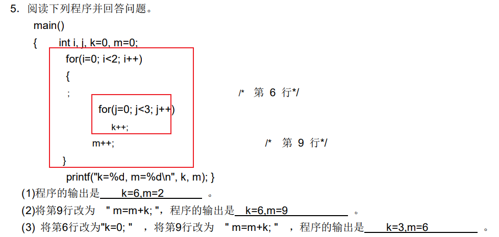


**while** (!x&&!y)中的循环条件表达式等价于:


**for**(表达式1;;表达式3)可理解为_______.


4-14

以下正确的函数定义形式是 ()。

 **A．double fun(int x, int y)** 

 B．double fun(int x ; int y) 

C．double fun(int x, int y); 

D．double fun(int x, y) 


以下不正确的说法是
A.实参可以是常量、变量或表达

B.实参可以是任何类型式

**C.形参可以是常量、变量或表达式**

D.形参应与对应的实参类型一致

**形参不能是常量**

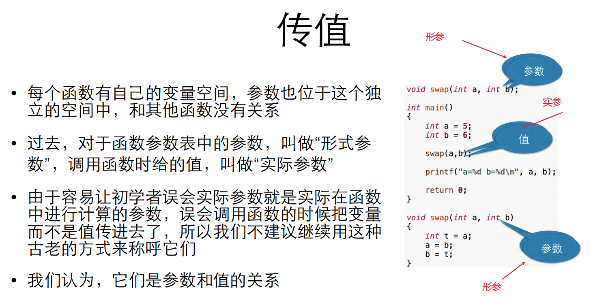


以下正确的说法是
A.实参与其对应的形参共同占用一个存储单元
**B.实参与其对应的形参各占用独立的存储单元**
C.只有当实参与其对应的形参同名时才占用一个共同的存储单元
D.形参是虚拟的，不占用内存单元


逻辑表达式 x && 1 等价于关系表达式 **x!=0** 。(!错误:x==1)


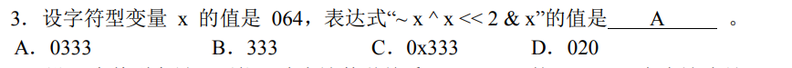

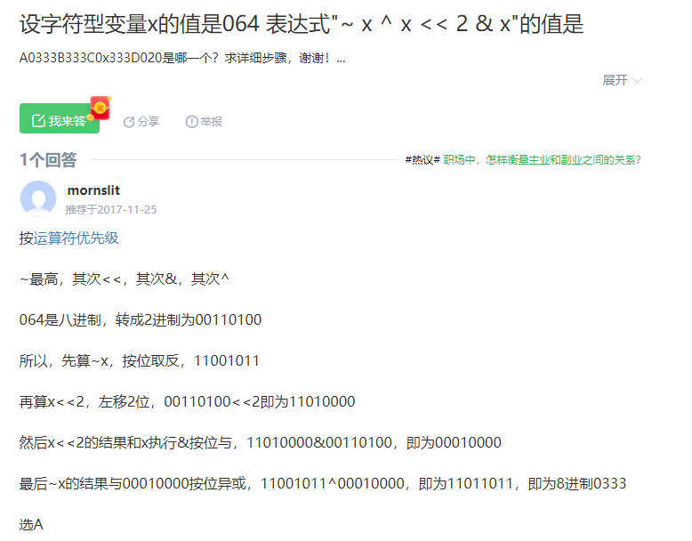


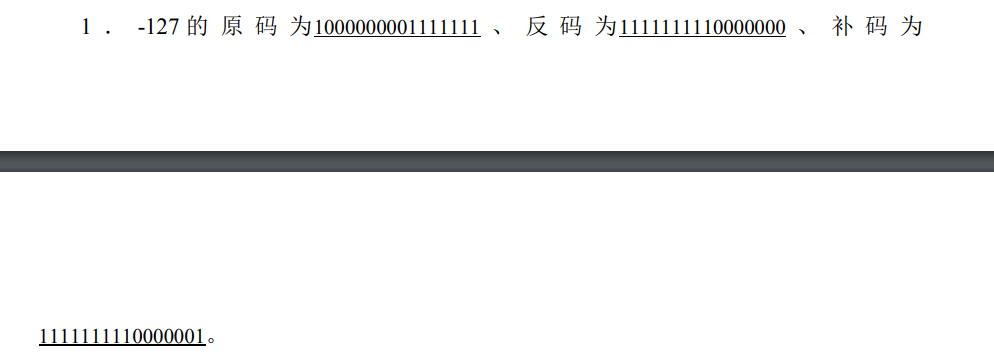


以下选项中，对基本类型相同的指针变量不能进行运算的运算符是   。 

**A．+** 

B．-

C．=

D．== 


若有以下说明，且 0<=i<10，则对**数组元素的错误引用**是  。

 int a[] = {0,1,2,3,4,5,6,7,8,9}, *p = a,i; 

*A．*\*(a+i) 

B．a[p-a+i]   //等价于a[i]

**C．p+i**

D．*(&a[i]) 


4．下列程序的输出结果是 。

 int main(void) { int a[10] = {0,1,2,3,4,5,6,7,8,9}, *p = a+3; printf(“%d”, *++p); return 0; } 

A．3 

**B．4**

C．a[4]的地址

D．非法

*p=a+3 等价于 a[3];  a[3]=3;


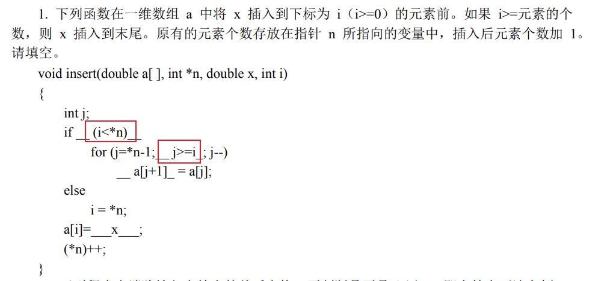


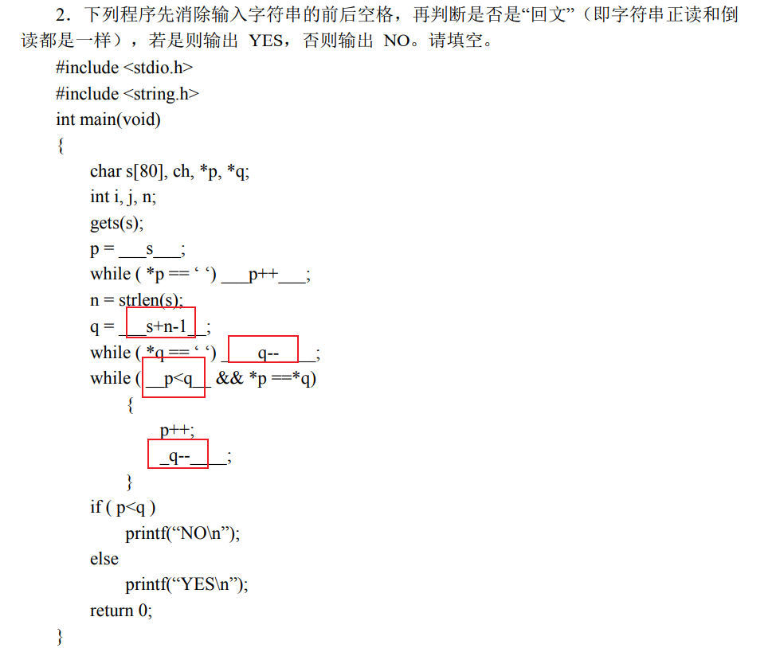


对于以下结构定义，(*p)->str++中的++加在  。

 struct { int len; char *str; } *p;

A．指针 str 上

B．指针 p 上

C．str 指向的内容上

**D．语法错误**


“.”称为 **成员（分量）** 运算符

“->”称为 **指向** 运算符

*称为**指针**运算符，是一个一元运算符，表示指针所指向的对象的值；
&称为**取地址**运算符，也是一个一元操作符，是用来得到一个对象的地址。


执行下列程序：

 #define MA(x, y) ( x*y ) 

i = 5;

 i = MA(i, i + 1) – 7; 

后变量 i 的值应为 

 A．30 

**B．19**

C．23 

D．1 


定义带参数的宏

#define JH(a,b,t) t = a; a = b; b = t

对两个参数 a、b 的值进行交换，下列表述中哪个是正确的  

A．不定义参数 a 和 b 将导致编译错误

B．不定义参数 a、b、t 将导致编译错误

**C．不定义参数 t 将导致运行错误**

D．不需要定义参数 a、b、t 类型

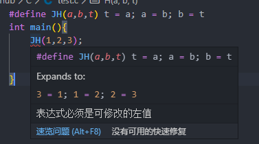

下面说法中正确的是  

**A．若全局变量仅在单个 C 文件中访问，则可以将这个变量修改为静态全局变量，以降低模块间的耦合度** 

**B．若全局变量仅由单个函数访问，则可以将这个变量改为该函数的静态局部变量，以降低模块间的耦合度**

C．设计和使用访问动态全局变量、静态全局变量、静态局部变量的函数时，需要考虑变量生命周期问题

D．静态全局变量使用过多，可那会导致动态存储区（堆栈）溢出


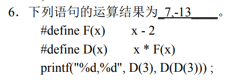

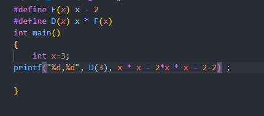

C语言提供了多种预处理功能，如**宏定义、文件包含、条件编译**等

**4-18**

若 a、b 都是 int 类型变量， ______不是正确的赋值语句。
**A．a=b=60**
B．a=3.0
C．a=1,3
D．b=0;

C99才行


若 k 是基本整型变量，则以下程序段的输出是_____。

 k=8567; printf("|%-6d|\n",k); 

A．输出格式描述符不正确

B．输出为|008567|

**C．输出为|8567 |**

D． 输出为|-08567|


调用字符函数时，要求在源文件中包下以下命令行：

**\#include <ctype.h>**

调用**字符串**函数时，要求在源文件中包下以下命令行：

**\#include <string.h>**


C 语言源程序文件经过 C 语言编译程序编译之后生成一个后缀为**.obj**的文件

常数的书写格式决定了常数的类型和值，**10L** 是。 

A．基本整型常数 

B．短整型常数 

**C．长整型常数** 

D．无符号型常数


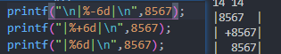

 表达式 ( (4|1)&3  ) 的值为**1** 。

 表达式 (~3&7 ) 的值为**4**。

 表达式 (~7&4 ) 的值为**0**。


下列程序段的输出结果是**2**。 

int *p, *q, k = 1, j=0 ; *

*p=&j; q = &k ; p = q ; (*p)++; 

printf("%d",*q); 

下列程序段的输出结果是**6**。

int *p, k = 5 ;

 \*p = &k ; ++(*p); 

printf("%d",k);


若 x 是单精度实型变量，表达式 (x = 10/4) 的值是 **2.0**

sizeof("key")==4(包含'\0')


C语言度中%3d  表示以3位的固定宽度输出整型数。

注意：不足知3位，道在前面补空格； 超过3位，**按实际位数**输出回（但是要在其范围内-32768 ~ 32767）。

```c
printf("%3d\n", 3);		// 输出_ _ 3  (其中 _ 表示空格)
printf("%3d\n", 312);	// 输出312 
printf("%3d\n", 3122);	// 输出3122
printf("%-3d\n", 3);	// 输出3 _ _
```

[二维数组指针引用]: http://c.biancheng.net/view/227.html

```c
int (*p)[N] = a;   
/*其中N是二维数组a[M][N]的列数, 是一个数字,  数组长度不能定义成变量*/
p[1][N-1] = size;
//这样赋值也是可以的  

*(p+i) == a[i];//等式两边作“*”运算得
*(p+i) + j == &a[i][j];//等式两边同时加上j行
```

 异或

```C
1^0=1;
1^1=0;
0^0=0;
3^6=5;//011^110->101
```

**5、下列描述，正确的是______ 。**

​    A、表达式3.2%5是合法的

​    **B、用b=8作为while循环的条件是合法的**

​    C、逗号表达式是没有值和类型的

​    D、字符型变量和int型变量的操作完全不同

8、已知：int a=4,b=5;则执行表达式"a=a>b"后,

  变量a的值为______。

  **A、0**    B、1    C、4    D、5

**19、设a、b、C、d、m、n均为int型变量，且a=5、b=6、c=7、d=8、**

  **m=2、n=1，则逻辑表达式(m==a>b)&&(n==c>d) 的值为______。**A

   A、0    B、 1    C、2     D、 3

28、以下程序的输出结果是 ______ 。

  main()

 {int a, b;

  for(a=1, b=1; a<=100; a++)

   {if(b>=10) break;

   if (b%3==1)

​     { b+=3; continue; }

   }

  printf("%d\n",a);

 }

  **A、4**    B、6    C、5    D、101

1%3==1

2%3==2

3%3==0

31、以下程序的输出结果是______ 。

  main()

  {int a=4,b=5,c=0,d;

  d=!a && !b || !c;

  printf("%d\n",d);

  }

  **A、1**    B、0    C、非0的数    D、-1

!a==0,!b==0  !a&&!b==0     ||!c==1

15、以下程序的输出结果是_________ 。

```C
#include<stdio.h>

main()

{

int x,t;

x=10;

t=(++x)+(++x); 

printf("%d\n",t);

}
```

A、20     B、23    **C、24**     D、22

++x=11,++x=12;

t=x+x=12+12=24;


19、有如下程序：

```C
 main()

 { 

  int i,sum;

  for(i=1;i<6;i++) 

  sum+=i;

  printf("%d\n",sum);

  }
```

**程序执行后sum的值是（20）****C**

A、15   B、14  C、不确定   D、0

未定义sum初始值

33、输入a和b 两个整数，按先大后小的顺序输出a 和b。

```C
main()

{ int *p1,*p2,a,b,*t;

 scanf("%d,%d",&a,&b );

 p1=&a;p2=&b;

 if(a<b)

{ _________}

printf("%d,%d\n", *p1,*p2 );}

}
```

在下划线处应填入的是

A、t=a;a=b;b=t;     **B、t=p1;p1=p2;p2=t;**

C、*t=p1;p1=p2;p1=*t;  D、*t=*p1;*p1=*p2;*p2=*t;

35、若有定义：int aa[8]; 则以下表达式中能代表数组元素aa[0]的

  **地址**的是_________ 

A、*aa[0]     B、aa[0]   **C、aa**   D、&aa

数组名本身就是指针地址

2、对C的源程序进行编译是指 ______ 。

  A、建立并修改源程序      **B、将C源程序翻译成目标程序**

  C、将目标程序连接成可执行程序 D、对程序进行查错和排错

18、以下程序段的输出结果是______ 。

  Char s[]="\113vwxyz\t";

  printf("%d\n",strlen(s));

​     A、8        B、10 

​     C、3        **D、7**

sizeof("key")==4(包含'\0')

strlen(s)==7 不包含'\0'


28、以下程序的输出结果是______ 。

   main()

  {int x=4,b=5,c=0,d;

  **d=!x && !b || !c;**

  printf("%d\n",d);

  }

  A、0    **B、1**    C、非0的数    D、-1

又看错了

14、以下程序的输出结果是______ 。

  main()

  {int a=3;

  printf("%d\n",a+=(a-=a*a) );

  }

  A、-6   B、12   C、0    **D、-12**

计算错误 3*3=9


3、C语言中规定函数的返回值类型是由_______

  A、调用该函数时的主调函数类型所决定的

  **B、调用该函数时所定义的调用函数类型所决定的**

  C、调用该函数时系统临时决定的

  D、return 语句中的表达式类型所决定的


**4、以下数据中不属于int类型的是______**。D

A、-32768             B、0x23

C、036               D、32768

带符号32位int类型整数为**-**214748**3648**~214748**3647**


**28、以下程序的输出结果是_______。C**

func(int a,int b)

{ int c;

 c=a+b;

 return c;

}

main( )

{ int x=6,y=7,z=8,r;

 r=func(**(x--,y++,x+y)**,z--); //注意陷阱

 printf("%d\n",r);

}

A、18   B、22     C、21    D、19


31、以下程序的输出结果是________ 

 main()

{ char c1=67; 

  if ('A'<=c1 && c1<='Z') 

  	 printf("%d,%c",c1,c1+1);

  else 

​		printf("%c",c1);

} 

A、68,E   **B、67,D**     C、65,A    D、66,C

31(扩展)、以下程序的输出结果是________ 

 main()

{ char c1=67; 

  if ('A'<=c1 && c1<='Z') 

  	 printf("%d,%c",c1,c1=c1+1); //先算第二个参数

  else 

​		printf("%c",c1);

} 

A、68,E   B、67,D     C、65,A    D、66,C  **E.68,D**


**32、若有定义：int \*p,a[4]={11,22,33,44};p=a;** 

**则以下表达式中能等于22的是_______**_

A、&a[0]+1  (地址)  B、++*p(地址);   C、a[0]++ (11)  **D、\*++p**


35、输入a和b 两个整数，按先大后小的顺序输出a 和b。

main()

{ int *p1,*p2,a,b,*t;

 scanf("%d,%d",&a,&b );

 p1=&a;p2=&b;

 if(a<b)

{ _________}

printf("%d,%d\n", *p1,*p2 );}

}

在下划线处应填入的是

A、t=a;a=b;b=t;     **B、t=p1;p1=p2;p2=t;**

C、\*t=p1;p1=p2;p1=*t;  D、\*t=\*p1;\*p1=\*p2;\*p2=\*t;

**6.****假定int类型变量占用两个字节，其有定义：int x[10]={0,2,4};，则数组x在内存中所占字节数是( D)。** 

A. 3        B. 6        C. 10         **D. 20**

**31.** **不能把字符串:Hello!赋给数组str的语句是(B)**。  

A. char str[10]= {'H', 'e', 'l', 'l', 'o', '! '};

**B. char str[10];str="Hello!";**

C. char str[10];strcpy(str,"Hello!");

D. char str[10]="Hello!";

**36.** **若有定义和语句**: 

char s[10];s="abcd";printf("%s\n",s);

则结果是(以下└┘代表空格)()。

A. 输出abcd   B. 输出a     C. 输出abcd└┘└┘└┘└┘  **D. 编译不通过**

与上题对应


在定义时对数组的每一个元素赋值叫数组的____初始化____;C语言规定，只有**静态**存储类型和**外部**存储类型的数组才可定义时赋值


\#include<stdio.h>

main()

{

 int i, j, row, column,m;

static  int  array\[3][3]={{100,200,300},{28,72,-30},{-850,2,6}};

m=array\[0][0];

for (i=0; i<3; i++)

for (j=0; j<3; j++)

if (array[i][j]<m)

{ m=array[i][j]; row=i; column=j;}

printf("%d,%d,%d\n",m,row,column);

}

上述程序的输出结果是 _-850，2,0_______


\#include <stdio.h>

  \#include <string.h>

  main()

{ 

 char a[]="clanguage",t;

​    int i, j, k;

​    k=strlen(a);

​    for(i=0; i<=k-2; i+=2)

​     for(j=i+2; j<=k; 【1】j+=2)

​       if( 【2】a[j]**<**a[i] )

​       { t=a[i]; a[i]=a[j]; a[j]=t; }

​     puts(a);

​    printf("\n");

   }

char  x[ ]= "language";

char  y[ ]= "llngga";

int  i=0;

while (x[i]!= 【1】’\0’ &&y[i]!= 【2】’\0’ )

{ if (x[i]==y[i]) printf("%c", 【3】x[**i++**]);

else i++;

}

**25.** **下面程序完成功能是：计算一个字符串中子串出现的次数**。

   \#include<stdio.h>

   main()

{ 

int i ,j, k,count;

char str1[20],str2[20];

printf("zhu chuan:");

gets(str1);

printf("zi chuan:");

gets(str2);

【1】count=0;

for(i=0;str1[i];i++)

for(j=i,k=0;str1[j]==str2[k];j++,k++)

if ( 【2】**!str2[k+1]==0** )

count++;

printf("chuxian cishu=%d\n",count);

} 

26. 下面程序完成以下功能：从键盘输入一行字符，统计其中有多少个单词，单词之间用空格分隔。

\#include<stdio.h>

main()

{

 char s[81];

int  i , c, num=0,word=0;

【1】gets(s);

for(i=0;(c=s[i])!=’\0’;i++)

​      if(c==32) 【2】**word=0;**

​      else if (word==0) {word=1; 【3】**num++;**}  

 printf("there are %d words.\n",num);

} 

c==32 :表示为空格


7． 下面叙述中正确的是（）。

A.#define和printf都是C语句    B.#define是C语句，而printf不是

C.printf是C语句，但#define不是  **D.#define和printf都不是C语句**


10．以下程序执行的输出结果是( )。 

\#define MIN(x,y) (x)<(y)?(x):(y)

main()

{ 

int i,j,k;

i=10;j=15;

k=10*MIN(i,j);

printf("%d\n",k);

}

**A.15**      B.100       C.10        D.150

解析：宏展开就是简单的字符串替换。语句k=10*MIN(i,j);经过宏展开为k=10*(i)<(j)?(i):(j);。由于*号的优先级要高于<号的优先级，因此要先进行10*(i)的运算；把值带入宏展开式为k=10*10<15?10:15;，条件表达式的值为15。所以选项A)是正确的。


19．执行如下程序后，输出结果为（ ）。

\#include <stdio.h>

\#define N 4+1

\#define M N*2+N

\#define RE 5*M+M*N

main()

{

printf("%d",RE/2);

}

A.150       B.100      **C. 41**      D.以上结果都不正确


条件编译的命令总共有三种：

一种是#ifdef 标识符…#else…#endif，作用是当标识符被定义过，就编译前一段程序，否则编译后一段程序；

第二种是#ifdef 标识符…#else…#endif，作用是当标识符未被定义过，就编译前一段程序，否则编译后一段程序；

第三种是#if 表达式…#else…#endif，作用是表达式的值为“真”时编译前一段程序，否则编译后一段程序。

1． 以下程序的输出结果是___7_____。

```c
#define MAX(x,y) (x)>(y)?(x):(y)

main()

{ 

int a=5,b=2,c=3,d=3,t;

t=MAX(a+b,c+d)*10;//(x)>(y)?(x):((y)*10)

printf("%d\n",t);

}
```

\#define PI **3.1415926**


计算圆的周长、面积和球的体积

\#define PI 3.1415926

\#define 【1】**CIRCLE(R,L,S,V)** L=2*PI*R; 【2】**S=PI*R*R;V=PI*R*R*R*4.0/3;**

main()                

{

float r,l,s,v;        

printf("input a rradus: ");

scanf("%f",&r); 

CIRCLE(r,l,s,v);

printf("r=%.2f\n l=%.2f\n s=%.2f\n v=%.2f\n", 【3】r,l,s,v);


12．下面程序的功能是从输入的十个字符串中找出最长的那个串。请在____A____处填空。

 

```c
 #include "stdio.h"

  \#include "string.h"

  \#define N 10

  main()

{ 

char s[N][81], * t;

int j;

 for (j=0; j<N; j++)

 gets (s[j]);

t= *s;

 for (j=1; j<N; j++)

 if (strlen(t)<strlen(s[j]))  ________;

  printf("the max length of ten strings is: %d, %s\n", strlen(t), t);
c
}

A． t=s[j]    B． t=&s[j]     C． t= s++     D． t=s[j][0]
```

数组本质上也是指针


下面判断正确的是（）。

A． char *s="girl";         等价于 char *s; *s="girl";

B． char s[10]={"girl"};      等价于 char s[10]; s[10]={"girl"};

**C**． char *s="girl";         等价于  char *s; s="girl";

D． char s[4]= "boy", t[4]= "boy";  等价于　char s[4]=t[4]= "boy"


15．下面程序段中，for循环的执行次数是（C）。

 

```C
 char *s="\ta\018bc"; //\018 \01 8

  for (；*s!='\0'；s++) printf("*");
```

A． 9          B． 5      C．  6       D． 7

19．设有如下的程序段：char s[]="girl", *t;  t=s;则下列叙述正确的是（D）。

A． s和t完全相同

B． 数组s中的内容和指针变量t中的内容相等

C． s数组长度和t所指向的字符串长度相等       普通数组和字符串常量

**D． *t与s[0]相等**


20．以下正确的程序段是（）。

A． char s[20];                B． char *s;

  scanf("%s", &s);               scanf("%s", s);

**C**． char s[20];                D． char s[20], *t=s;

   scanf("%s", &s[2]);              scanf("%s", t[2]);


22．以下与库函数strcpy(char *p, char *q)功能不相等的程序段是（D）。

A． strcpy1(char *p, char *q)

{ while ((*p++=*q++)!='\0');

}

B． strcpy2( char *p, char *q)

{  while((*p=*q)!='\0')

​    {p++;   q++;}

}

C． strcpy3(char *p, char *q)

{ while (*p++=*q++);

}

  **D**． strcpy4( char *p, char *q)

   {  while(*p)

​       *p++=*q++;

}

25．以下与库函数strcmp(char *s, chat *t)的功能相等的程序段是（C）。

A． strcmp1( char *s, chat *t)

{ for ( ；*s++==*t++ ；)

​    if (*s=='\0') return 0;

  return (*s-*t);

}

B． strcmp2( char *s, char *t)

 { for ( ；*s++==*t++ ；)

if (!*s) return 0;

​     return (*s-*t);

 **C． strcmp3( char *s, char *t)**

  **{ for ( ；*t==*s ；)**

**{ if (!*t) return 0;**

  **t++;**

  **s++;}**

​      **return (*s-*t);** 

 **}**

D． strcmp4( char *s, char *t)

{  for( ；*s==*t；s++,t++)

  if (!*s) return 0;

return (*t-*s);

}

26．若有以下定义和语句：

int s\[4][5], (*ps)[5]; 

ps=s;

则对s数组元素的正确引用形式是（C）。

A． ps+1    B． *(ps+3)    C． ps\[0\]\[2\]     D． *(ps+1)+3

27．不合法的main函数命令行参数表示形式是：（**B**）。

A． main( int a, char *c[])         B． main(int argc, char *argv)

C． main( int arc, char \*\*arv)        D． main( int argv, char*argc[])

33．下面程序的功能是将八进制正整数字符串转换为十进制整数。请选择填空。

\#include "stdio.h"

\#include "string.h"

main()

{ 

char *t, s[8];

 int n;

 t=s;

 gets(t);

 n=【1】;

 while (【2】!= '\0') n=n*8+*t-'0';

 printf("%d\n", n);

}

C【1】A． 0      B． *t       C． *t-'0'       D． *t+'0'

**C**【2】A． *t     B． *t++      C． *(++t)        D． t

```c
35．以下程序的功能是删除字符串s中的所有空格（包括TAB符、回车符），请填空。
    #include "stdio.h"
    #include "string.h"
    #include "ctype.h"
    main()
{ 
char  s[80];
gets(s);
delspace(s);
puts(s);
}
    delspace(char *t)
{ 
int m, n;
char c[80];
for(m=0, n=0; 【1】; m++)
   if (!isspace(【2】)) /*C语言提供的库函数，用以判断字符是否为空格*/
{
 c[n]=t[m];
   n++;
}
c[n]='\0';
strcpy(t, c);
}

```

  **A** 【1】A． t[m]         B． !t[m]           C． t[m]='\0'       D． t[m]=='\0'
C【2】A． t+m         B． *c[m]           C． *(t+m)          D． *(c+m)

```C
36．下面程序的功能是统计字串sub在母串s中出现的次数。请选择填空。
    #include "stdio.h"
    #include "string.h"
    main()
{ 
char s[80], sub[80];
int n;
gets(s);
gets(sub);
printf("%d\n", count(s,sub));
}
int count( char *p, char *q)
{  
int m, n, k, num=0;
  for (m=0; p[m]; m++)
      for (【1】, k=0; q[k]==p[n]; k++, n++)
          if(q[【2】]=='\0')
             { num++;  break;}
  return (num);
}

```

**B**【1】A． n=m+1    B． n=m      C． n=0       D． n=1

**C**【2】A． k       B． k++      C． k+1       D． ++k

```c
40．有以下程序
#include "string.h"
#include "stdio.h"
main()
{ 
char *p="abcde\0fghjik\0";
printf("%d\n", strlen(p));
}

```

 程序运行后的输出结果是（）。 

A． 12       B． 15       C． 6       **D**． 5

printf 读到\0就结束

```c
44．下面程序的运行结果是（）。
    #include "stdio.h"
    #include "string.h"
    fun( char *s)
{ 
char t[10];
s=t;
strcpy(t, "example");
}
    main()
{ 
char *s;
fun(s);
puts(s);
     }

```

A．example└┘└┘└┘    B．example└┘└┘     C．example    **D．不确定的值**

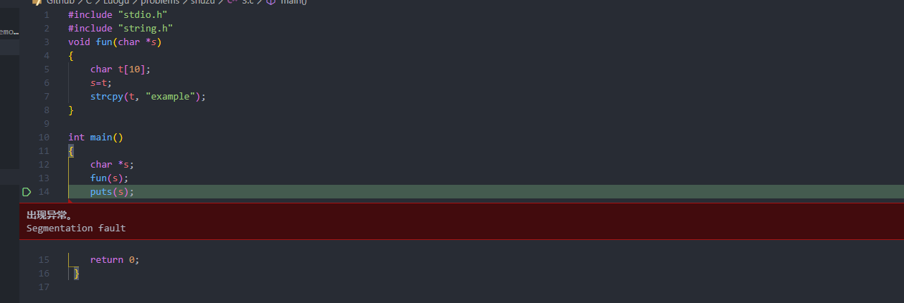

```C
48．有以下函数：
char *fun(char *s)
{   …
  return s;
} 
```

该函数的返回值是（）。
A． 无确定值                            **B． 形参s中存放的地址值**
C． 一个临时存储单元的地址   D． 形参s自身的地址值

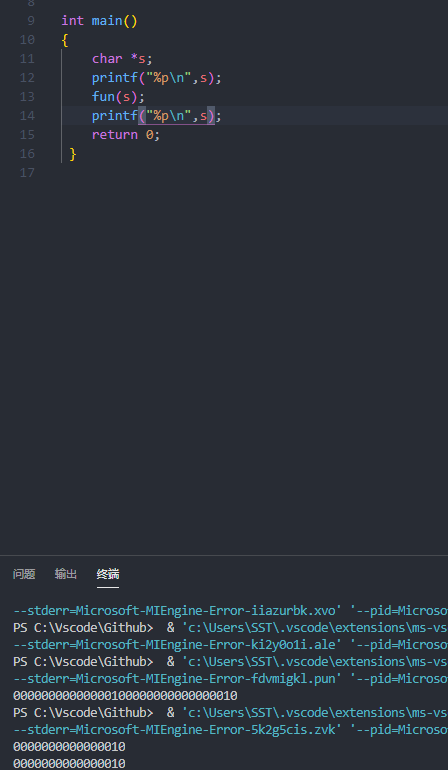

2．请填空：

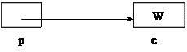

建立如图所示存储结构所需的**说明语句**是【1】。**char *p,c**

建立如图所示**给c输入数据的输入语句**是【2】。**scnaf(“%c”,&c);**

建立如图所示存储结构所需的赋值语句是【3】。p=&c;

7． 下面程序的运行结果是  **3 5**____。

```c
void swap(int *a, int *b)

{ 

 int *t;

  t=a; 

  a=b;

  b=t;

}

main()

{ 

int x=3, y=5, *p=&x, *q=&y;

 swap(p,q);

 printf("%d %d\n", *p, *q);

}
```

```c
10．下面程序的功能是比较两个字符串是否相等，若相等则返回1，否则返回0。请填空。
#include "stdio.h"
    #include "string.h"
fun (char *s, char *t)
{
int m=0;
while (*(s+m)==*(t+m) &&【1】 s[m]!='\0') m++;
return (【2】(*(s+m)=='\0'&&*(t+m)=='\0')?1:0);
}

```

```c
12．下面程序是判断输入的字符串是否是“回文”，（顺读和倒读都一样的字符串称为“回文”，如level）。请填空。
#include "stdio.h"
#include "string.h"
main()
{ 
 char s[80], *t1, *t2;
   int m;
   gets(s);
   m=strlen(s);
   t1=s;
   t2=【1】s+m-1;//要减去1
   while(t1<t2)
   {  if (*t1!=*t2)  break;
      else { t1++; 
【2】t2--;}
}
        if (t1<t2) printf("NO\n");c
        else printf("YES\n");
     }

```

```c
14．当运行以下程序时，从键盘输入6↙，则下面程序的运行结果是__976531______。
#include "stdio.h"
#include "string.h"
main()
{ 
char s[]="97531", c;
  c=getchar();
  f(s,c);
  puts(s);
}
f(char *t, char ch)
{ 
 while (*(t++)!='\0');
   while（*（t-1）<ch）
        *(t--)=*(t-1);
   *(t--)=ch;
}

```

```c
15．若有定义：int a[]={1,2,3,4,5,6,7,8,9,10,11,12}, *p[3], m; 则下面程序段的输出是__11______。
    for ( m=0; m<3; m++) p[m]=&a[m*4];
    printf("%d\n", p[2][2]);c
```

p[2]=a[8]

p\[2][2]=*(&a[8]+2)=a[10]

```c
16．下面程序的运行结果是__2,2______。
#include "stdio.h"
main()
{ 
char s[]="1357", *t;
  t=s;
printf("%c, %c\n", *t, ++*t);
}

```

**陷阱题!**

先 ++*t=2(\*t=\*t+1)

后*t=2

25．定义语句int \*f();和int (*f)();的含义分别为【1】函数的返回值为int类型的指针 和【2】定义一个指向函数的指针。