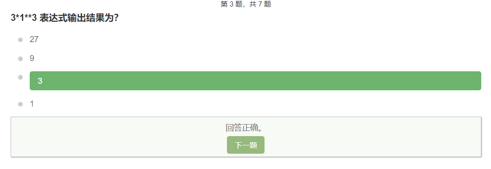
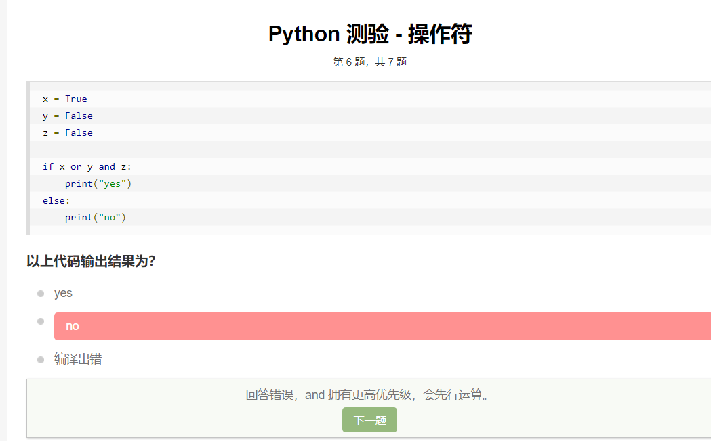

```python
将字符串 "example" 中的字母 a 替换为字母 b，以下代码正确的是？

example.swap('b', 'a')
example.replace('a','b')  #这个

example.match('b','a')
example.replace('b','a')
```

```python
def f(): pass

print(type(f()))

以上代码输出结果为？

<class 'function'>
<class 'tuple'>
<class 'NoneType'> #this
<class 'str'>
<class 'type'>
```

```python
如果函数没有使用 return 语句，则函数返回的是？

0
None 对象 #this
任意的整数
错误! 函数必须要有返回值。
```


递归函数用于调用函数的本身





优先级顺序为 NOT、AND、OR。